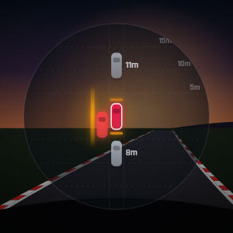
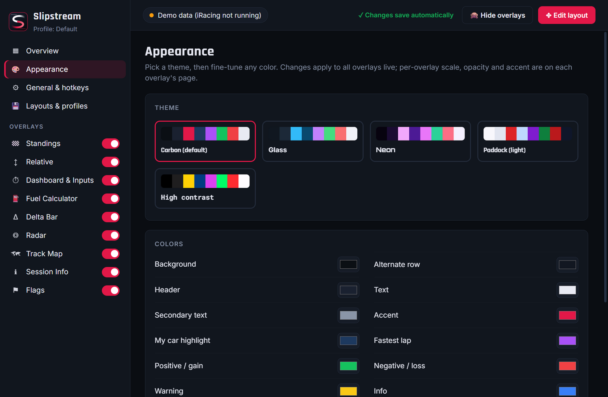

<p align="center"></p>

<h1 align="center">Slipstream</h1>

<p align="center">
Customizable, open overlays for iRacing, in the spirit of RaceLab.<br>
Standings, relative, inputs, fuel, delta, radar, an auto-learned track map and more.
</p>

<p align="center">
  <a href="https://github.com/antonholovko-cloud/Slipstream/releases/latest"><b>⬇ Download for Windows</b></a>
</p>


<sub>Screenshot generated from Slipstream's built-in demo race (`npm run screenshots`), drawn over a painted backdrop.</sub>

## Install

Download from the [latest release](https://github.com/antonholovko-cloud/Slipstream/releases/latest):

- **`Slipstream-Setup-x.y.z.exe`**: installer with Start menu and desktop shortcuts.
- **`Slipstream-Portable-x.y.z.exe`**: a single exe that needs no installation.

The builds aren't code-signed yet, so Windows SmartScreen may warn on first launch. Click **More info → Run anyway**.

Then:

1. Set iRacing's display mode to **Borderless** or **Windowed**. Windows can't draw overlays on top of exclusive fullscreen.
2. Start Slipstream. It lives in the system tray; click the tray icon to open settings.
3. Press **Ctrl+Shift+E** to enter edit mode and drag or resize the overlays. Press it again to lock them.

While iRacing isn't running, the overlays show a simulated race whenever the settings window is open, so you can
set everything up without the sim.

## Run from source

```powershell
npm install
npm start             # live iRacing data, demo preview while configuring
npm run demo          # force demo data
npm run check         # self-test: fake iRacing memory map → reader → model
npm run dist          # build installer + portable exe into dist/
npm run screenshots   # regenerate docs/screenshots
```

The app is built on Electron and reads iRacing's telemetry straight from shared memory. It needs no native build
and no extra services.

## Overlays

| Overlay | Highlights |
|---|---|
| **Standings** | Multiclass grouping with class SOF, gap/interval, last/best (purple = fastest), iRating, license/SR, **estimated iRating +/-**, positions gained, pit-stop count, and "keep my car visible" windowing |
| **Relative** | Cars around you by live time gap, lapping/lapped coloring, pit tags, and an info bar (position, SOF, incidents, time left) |
| **Dashboard & Inputs** | Car-specific shift lights (from iRacing's SL RPMs), gear, speed, RPM bar, a throttle/brake/clutch trace with ABS-colored brake, pedal bars, a rotating wheel, lap/last/best/delta, fuel, brake bias, engine warnings and pit limiter. Every block can be switched off |
| **Fuel Calculator** | Rolling average, last and max per lap (green-flag laps only), laps left, fuel to finish with a safety margin, amount to add, stops needed |
| **Delta Bar** | Delta vs best, optimal, session best, session optimal or last lap, trend coloring, predicted lap |
| **Radar** | A box for every car around you, with glowing side bars when someone is alongside and proximity bars ahead/behind. Adjustable view radius (5–100 m), circle or lane shape, car size and numbers, and auto-hide when clear |
| **Track Map** | **Learned automatically** by dead-reckoning your first clean lap, then saved per track. Shows class colors, pit cars and the S/F line, with rotate/mirror |
| **Session Info** | Session, time or laps left, lap, position, incidents vs limit, SOF, temperatures, wetness, local and sim clock |
| **Flags** | Checkered, red, black, meatball, caution, debris, yellow, blue, white, one-to-green and green, with a waving animation |

## Screenshots

| | |
|---|---|
|  |  |
|  |  |
|  |  |
|  |  |

**Settings:** every overlay is configured live, with drag-and-drop columns, themes and profiles.




## Customization

- **Every overlay**: position, size, scale (50–250%), background opacity, header, accent color, refresh rate, and
  per-session visibility (practice, qualifying, race, or hidden when you're not in the car).
- **Columns**: drag-and-drop reorder plus per-column toggles for Standings, Relative and Session Info.
- **Themes**: five built-in themes. Every color, the font and the corner radius can be overridden.
- **Saved automatically**: every change (positions, sizes, options, theme) is written to disk immediately and restored
  at the next start, including after updates. A backup is taken at every start (last 15 kept) and can be restored
  from *Layouts & profiles*.
- **Layouts & profiles**: save the current layout under a name, keep unlimited layouts (e.g. road, oval, streaming), and
  switch from the tray or with a hotkey. Export/import single profiles or all settings (to move to another PC).
- **Hotkeys** (global, rebindable): toggle edit mode `Ctrl+Shift+E`, show/hide `Ctrl+Shift+H`,
  open settings `Ctrl+Shift+S`, next profile `Ctrl+Shift+P`.
- **Edit layout**: drag an overlay anywhere, resize it from the corner grip, and use the arrow keys to nudge
  (`Shift` = 10px, `Ctrl` = resize). Snap-to-grid is configurable.
- **Units** follow iRacing's setting, or can be forced to metric or imperial.
- In replays or when spectating, the overlays follow the camera car.

Settings are stored in `%APPDATA%\Slipstream\overlay-config.json`.

## Architecture

```
src/main/irsdk.js     shared-memory reader (koffi → kernel32), var decoding, tolerant session YAML parsing
src/main/model.js     derived state: standings, classes/SOF, relative, radar, fuel, track learning, iRating
src/main/mock.js      physically plausible demo race (speed profile, pit stops, flags, duels)
src/main/main.js      windows, 60 Hz loop, per-overlay fps throttling and data slicing, IPC, tray, hotkeys
src/main/config.js    profiles + forward-compatible migration of saved configs
src/shared/registry.js  overlay definitions and settings schemas (drives the settings UI)
src/renderer/         overlay host + one self-contained widget per overlay, settings app
```

### Adding a new overlay

1. Add an entry to `OVERLAYS` in `src/shared/registry.js`, with `id`, `bounds`, `needs` (the state slices it uses)
   and a `schema`. The settings page is generated from the schema automatically.
2. Create `src/renderer/widgets/<id>.js` with `Host.register('<id>', (root) => ({ update(state, ctx) {…} }))`.
3. Add a `<script>` tag for it in `overlay.html`.

### Releasing

Bump `version` in `package.json`, commit, then push a matching tag:

```powershell
git tag v0.2.0; git push origin v0.2.0
```

The **Release** workflow builds the installer and portable exe on GitHub Actions and publishes them as a GitHub Release.

### Dev flags

`IRO_USERDATA=<dir>` isolates the config. `IRO_SCREENSHOT=<dir>` captures every window and quits.
`IRO_EDIT=1` starts in edit mode. `IRO_DEMO_SKIP=<sec>` sets where the demo race starts. `IRO_PAGE=ov:standings`
opens a specific settings page.

## Notes

- Slipstream is an independent project and is not affiliated with or endorsed by iRacing.com Motorsport Simulations.
- The iRating change is an estimate that uses the community-derived iRacing formula, per class.
- The Track Map needs one clean lap per track/config to learn the shape. Until then it shows a ring layout.
