<p align="center">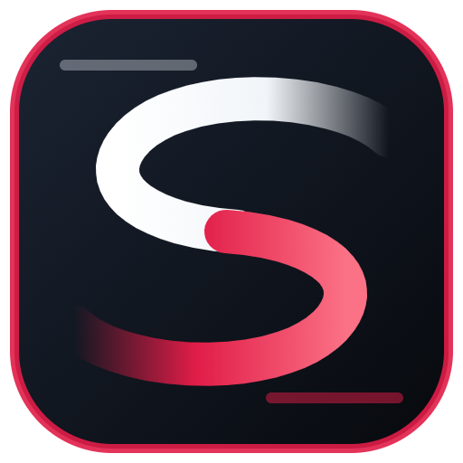</p>

<h1 align="center">Slipstream</h1>

<p align="center">
Free, customizable overlays for iRacing.<br>
Standings, relative, dashboard & inputs, lap timing, fuel, delta, an auto-learned track map and more.
</p>

<p align="center">
  <a href="https://github.com/antonholovko-cloud/Slipstream/releases/latest"><b>⬇ Download for Windows</b></a>
</p>

<p align="center">
  <a href="https://youtu.be/c6TtdptDriM" title="Watch on YouTube">
    
  </a><br>
  <sub>▶ <a href="https://youtu.be/c6TtdptDriM"><b>Watch Slipstream in a real race on YouTube</b></a></sub>
</p>

<p align="center">
  💬 <a href="https://github.com/antonholovko-cloud/Slipstream/discussions"><b>Discussions</b></a> for ideas, questions and your layouts ·
  🐞 <a href="https://github.com/antonholovko-cloud/Slipstream/issues/new/choose"><b>Report a bug</b></a>
</p>

<div align="center">
<table>
  <tr>
    <td align="center">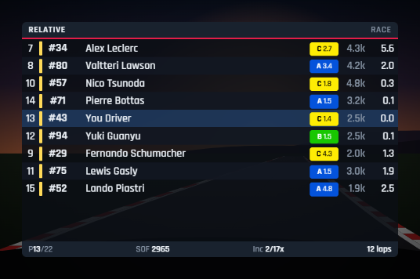<br><sub><b>Relative</b>, one class</sub></td>
    <td align="center">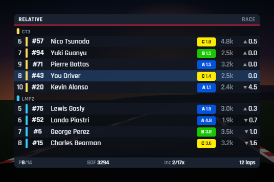<br><sub><b>Relative</b>, multiclass: grouped by class, ▲ / ▼ = ahead / behind</sub></td>
  </tr>
  <tr>
    <td align="center">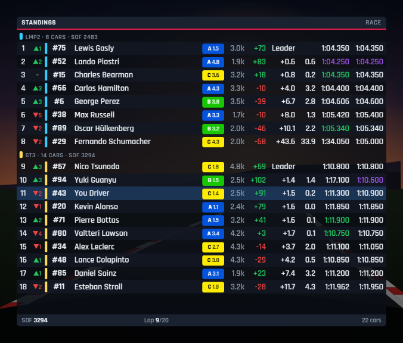<br><sub><b>Standings</b></sub></td>
    <td align="center">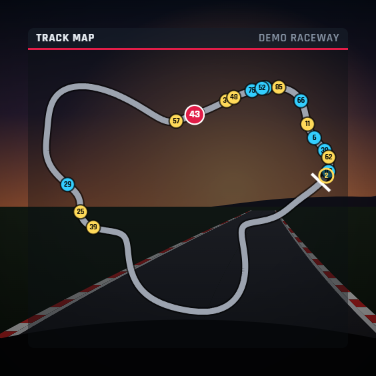<br><sub><b>Track map</b></sub></td>
  </tr>
  <tr>
    <td align="center">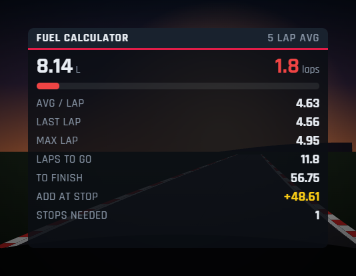<br><sub><b>Fuel calculator</b></sub></td>
    <td align="center">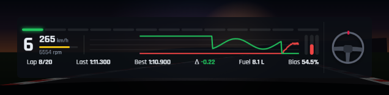<br><sub><b>Dashboard &amp; Inputs</b></sub></td>
  </tr>
  <tr>
    <td align="center">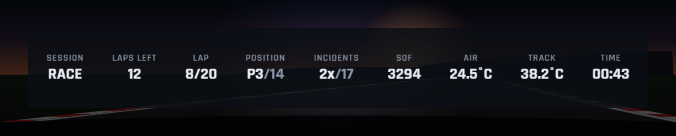<br><sub><b>Session info</b></sub></td>
    <td align="center">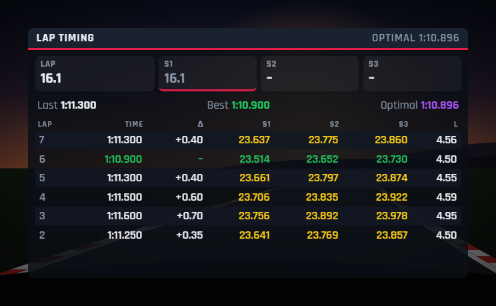<br><sub><b>Lap timing</b></sub></td>
  </tr>
  <tr>
    <td align="center">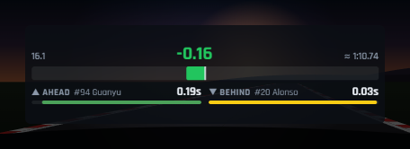<br><sub><b>Delta bar</b></sub></td>
    <td align="center">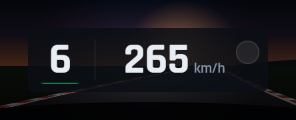<br><sub><b>Speed</b></sub></td>
  </tr>
  <tr>
    <td align="center" colspan="2">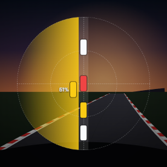<br><sub><b>Radar</b>: a car alongside on the left (61% overlap), one close behind</sub></td>
  </tr>
</table>
</div>

<p align="center">
  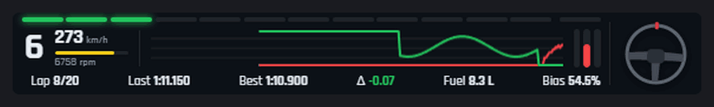<br>
  <sub><b>Dashboard &amp; Inputs:</b> shift lights fill as you rev and strobe blue only on over-rev; the brake line turns yellow where a wheel locked; wheelspin / lock-up light, gear, speed and steering wheel update live.</sub>
</p>

<p align="center">
  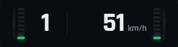<br>
  <sub><b>Speed:</b> just speed and gear. The background behind the gear rises with RPM and blinks at the shift point; the lamp shows SPIN / LOCK.</sub>
</p>

<p align="center">
  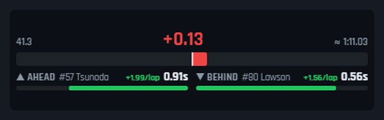<br>
  <sub><b>Delta bar:</b> green when you're up on your best lap, red when you're down. Below: gaps to the cars ahead and behind, turning green while you gain on them and red while you lose time.</sub>
</p>

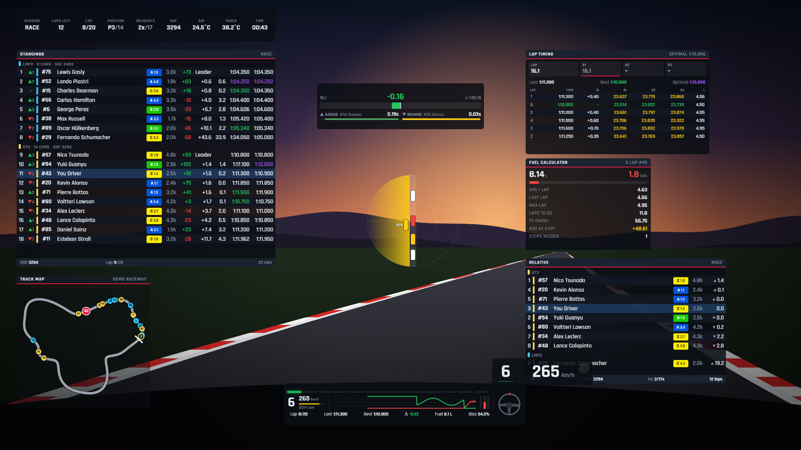

## Free forever, made for the community

Slipstream is a community project for sim racers. **It is free and always will be.** There is no paid version,
no subscription, no "pro" features behind a paywall, and no ads. It is open source under the MIT license, so
anyone can read, build and improve it.

## Your privacy

**Slipstream collects no personal data and never sends anything about you anywhere.**

- No accounts, no sign-in, no analytics, no telemetry, no crash reporting.
- It reads iRacing's telemetry from your own PC's memory and draws it on your screen. 
- The **only** internet connection it can make is the **update check**, and only if you allow it. It asks
  GitHub, where Slipstream is published, whether a newer version exists. Nothing about you or your PC is sent.
  Say no, or turn it off any time, and Slipstream never goes online.
- Your settings, profiles and learned track maps stay in a local file on your computer
  (`%APPDATA%\Slipstream`), and nowhere else.

## Getting started

### 1. Download and install

Get the latest version from the [releases page](https://github.com/antonholovko-cloud/Slipstream/releases/latest).
Pick one:

- **`Slipstream-Setup-x.y.z.exe`**: installs Slipstream with Start menu and desktop shortcuts. Recommended.
- **`Slipstream-Portable-x.y.z.exe`**: a single file that runs without installing. Keep it in any folder.

Slipstream isn't code-signed yet, so Windows may show a blue **"Windows protected your PC"** box the first time.
Click **More info**, then **Run anyway**.

### 2. Put iRacing in borderless windowed mode

Windows can't draw overlays on top of a game running in **exclusive fullscreen**, so iRacing has to run in a
window. Borderless windowed looks exactly like fullscreen, with no title bar, and performs the same on
Windows 10 and 11.

1. **Close iRacing completely.** iRacing saves its settings when it exits, so changes made while it's running
   are lost.
2. Open File Explorer and go to **`Documents\iRacing`**.
3. Open **`rendererDX11Monitor.ini`** with Notepad (right-click → *Open with* → *Notepad*).
   If you also have **`rendererDX11.ini`**, make the same changes there too.
4. Find these lines (press **Ctrl+F** to search) and change the numbers so they read:

   ```ini
   fullScreen=0
   border=0
   windowedMaximized=1
   windowedXPos=0
   windowedYPos=0
   ```

   Only change the number after the `=`. Leave the rest of each line as it is.
5. Check that **`windowedWidth`** and **`windowedHeight`** match your screen resolution, for example
   `1920` and `1080`, or `2560` and `1440`.
6. Save the file (**Ctrl+S**) and start iRacing.

iRacing should now fill the whole screen with no title bar or buttons at the top. If you see a title bar,
`border` is still `1`. If the game only covers part of the screen, check `windowedWidth` and `windowedHeight`.

> **Tip:** make a copy of the file before editing it. To go back to fullscreen later, set `fullScreen=1`.

### 3. Start Slipstream and place your overlays

1. Start **Slipstream**. It runs in the **system tray**, next to the clock. Click its icon to open the settings.
2. While iRacing isn't running, the overlays show a **demo race**, so you can set everything up without the sim.
3. Press **Ctrl+Shift+E** to enter **edit mode**. Drag overlays to move them and use the corner grip to resize them.
   Press **Ctrl+Shift+E** again to lock them in place.
4. Turn overlays on or off, and change what they show, in the settings window.

Everything is saved automatically. By default, overlays hide while you're in the garage or out of the car,
and show again when you drive.

## Overlays

| Overlay | What it shows |
|---|---|
| **Standings** | Multiclass grouping with class SOF, gap/interval, last/best lap (purple = fastest), iRating, license/SR, **estimated iRating +/-**, positions gained, pit stops, and "keep my car visible". **Off by default**; turn it on in settings |
| **Relative** | Cars around you by live time gap, lapping/lapped colors, pit tags, cars grouped by class in multiclass races, and an info bar (position, SOF, incidents, time left) |
| **Dashboard & Inputs** | Car-specific shift lights with a bright blue over-rev strobe (you choose where it starts), gear, speed, RPM, a throttle/brake/clutch trace, pedal bars, a steering wheel, lap/last/best/delta, fuel, brake bias, engine warnings, pit limiter, and a **wheelspin / lock-up light** that strobes while you're slipping, with the brake trace turning yellow where a wheel locked. Every part can be switched off |
| **Speed** | Just speed and gear, with a rev indicator behind the gear (rises with RPM, blinks at the shift point) and a wheelspin / lock-up lamp |
| **Lap Timing** | Live sector times (green = personal best, purple = class best), last/best/optimal lap, and a lap log with sectors, delta, fuel used, and off-track/pit markers |
| **Fuel Calculator** | Average, last and max fuel per lap (green-flag laps only), laps left, fuel to finish with a safety margin, amount to add, stops needed |
| **Delta Bar** | Live delta to your best, optimal, session best or last lap, predicted lap time, and gap bars to the cars directly ahead and behind that turn green while you gain and red while you lose. In races these are the class cars physically ahead and behind you on track, so after a spin they update at once instead of waiting for the next timing line |
| **Radar** | Cars around you from above. Distance ahead / behind is exact; the side comes from the iRacing spotter (iRacing doesn't share where other cars are across the track), with a yellow glow on the side a car is alongside, orange when you're three wide, and the overlap in %. A car keeps its side for a few seconds after it pulls ahead or drops back. Hides when nobody is near |
| **Track Map** | **Learned automatically** from your first clean lap, then saved for that track. Shows every car in class colors, cars in the pits and the start/finish line. **Off by default**; turn it on in settings |
| **Session Info** | Session, time or laps left, lap, position, incidents vs limit, SOF, temperatures, track wetness, local and sim time. **Off by default**; turn it on in settings |
| **Flags** | A big flag indicator: checkered, red, black, meatball, caution, debris, yellow, blue, white, one-to-green and green. **Off by default**; turn it on in settings |

## Customizing

Every change you make is saved right away and kept after updates.

- **Each overlay:** position, size, scale (50–250%), background opacity, header, accent color, refresh rate,
  and which sessions it shows in (practice, qualifying, race).
- **Columns:** drag to reorder and switch columns on or off in Standings, Relative and Session Info.
- **Themes:** five built-in themes. You can change any color, the font and the corner rounding.
- **Layouts & profiles:** save different layouts (for example road, oval, streaming) and switch between them
  from the tray or with a hotkey. You can export a profile to share it or move it to another PC.
- **Backups:** a backup of your settings is made every time Slipstream starts (the last 15 are kept). Restore
  one from *Layouts & profiles*.
- **Units** follow your iRacing setting, or can be set to metric or imperial.
- **Replays and spectating:** the overlays follow the car the camera is on.

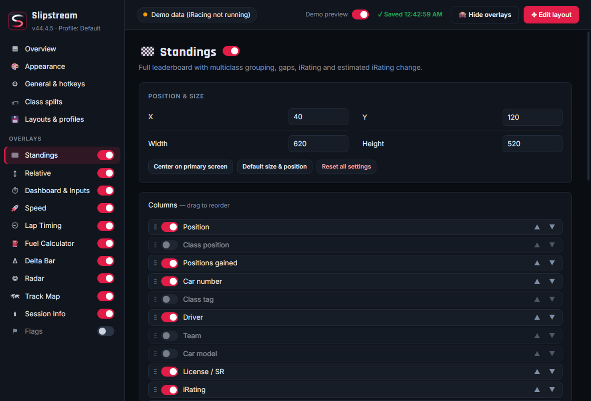

### League class splits (Pro / Am)

Many leagues split one iRacing class into their own classes, for example GT3 into **GT3 Pro** and **GT3 Am**.
iRacing only knows the car class, so on the *Class splits* page you tell Slipstream who belongs where: by car
number range, by a list of drivers (names or customer IDs), by iRating range, or "all other cars". A rule can be
limited to one league ID, so each league's split only applies in its own sessions. The Relative, Standings,
Delta and Track Map then show positions, gaps, SOF and colors per sub-class. In multiclass sessions the Relative
groups cars by class (your class first), with ▲ / ▼ showing whether each car is ahead of or behind you.

| Relative | Standings |
|---|---|
| 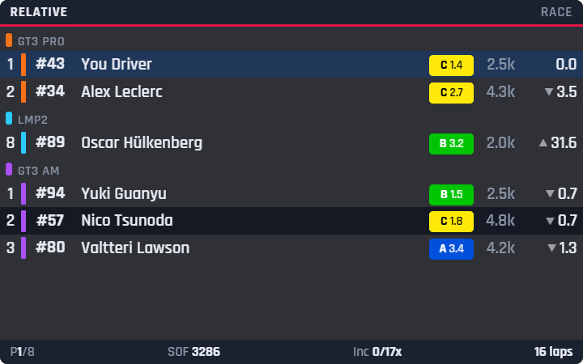 | 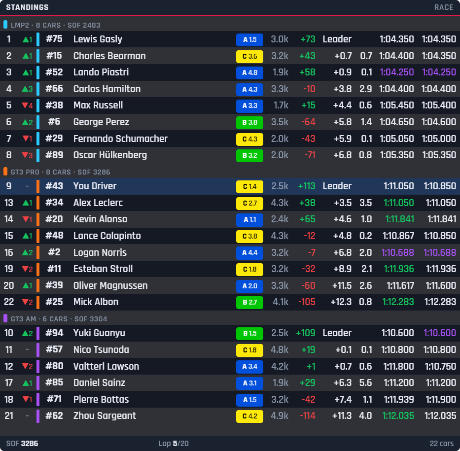 |

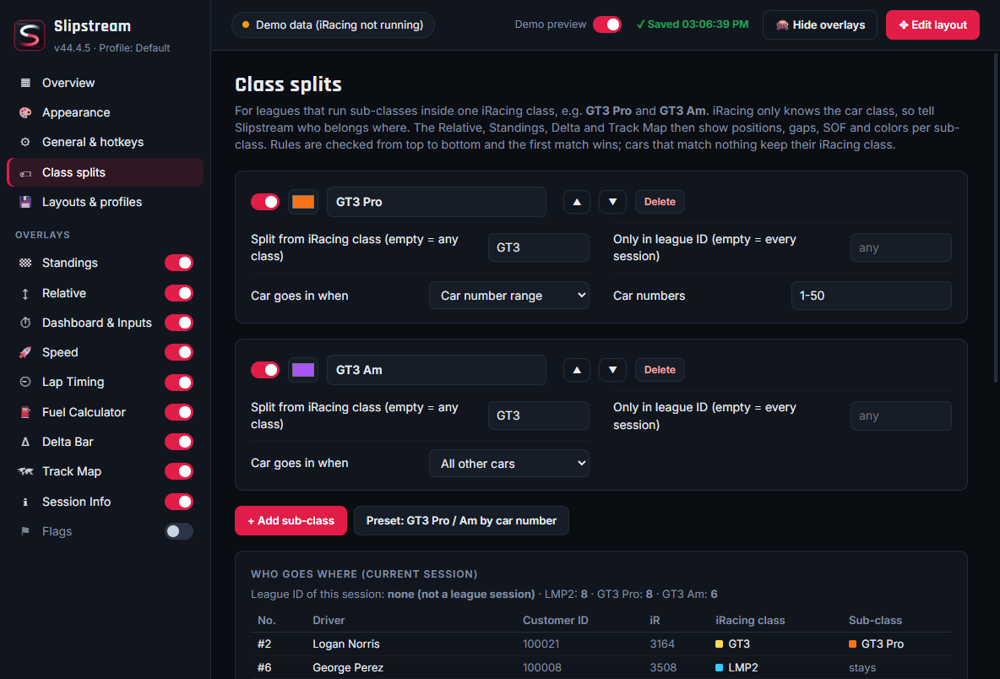

### Hotkeys

Work anywhere, even while iRacing has focus. You can change them in *General & hotkeys*.

| Keys | Action |
|---|---|
| **Ctrl+Shift+E** | Edit mode on/off (move and resize overlays) |
| **Ctrl+Shift+H** | Show/hide all overlays |
| **Ctrl+Shift+S** | Open settings |
| **Ctrl+Shift+P** | Switch to the next profile |

In edit mode you can also nudge the selected overlay with the **arrow keys** (**Shift** = 10 px steps,
**Ctrl** = resize).

## Troubleshooting

**The overlays don't show up in iRacing.**
iRacing is probably in exclusive fullscreen. Follow [step 2](#2-put-iracing-in-borderless-windowed-mode).
Also check that overlays aren't hidden with **Ctrl+Shift+H**, and that the overlay is switched on in settings.

**My iRacing changes keep going back.**
iRacing was running while you edited the file and overwrote it when it closed. Close iRacing fully, then edit again.

**iRacing has a title bar with buttons at the top.**
Set `border=0` in `Documents\iRacing\rendererDX11Monitor.ini` (and in `rendererDX11.ini` if you have it),
with iRacing closed.

**The overlays disappear when I stop in the pits.**
That's on purpose, so they don't clutter the screen. The Fuel Calculator stays visible, since that's when you
need it. Turn it off for all overlays in *General & hotkeys*, or choose per overlay: open the overlay's page and
set **When stopped in the pits** to *Keep showing* or *Hide*.

**The track map is just a circle.**
It learns the track from your first clean lap (no pit stop, no off-track). After that it's saved for that track.

**I use VR.**
Slipstream draws on your monitor, so the overlays won't appear inside a VR headset.

## Updating and uninstalling

The first time you open Slipstream it asks whether to **check for updates automatically**. You can change
this any time in **General & hotkeys → Updates**, which also has a **Check now** button.

- **Installed version:** new versions download in the background and install when you quit Slipstream. A
  notification tells you when one is ready; click **Restart and update now** to install it straight away.
- **Portable version:** Slipstream tells you when a new version is out, with a link to download it.
- **Manually:** download the new version from the [releases page](https://github.com/antonholovko-cloud/Slipstream/releases/latest)
  and install it over the old one.

Your settings and layouts are always kept.

- **Versions before 0.4.6** can't update themselves. Install the latest version once by hand, and it keeps
  itself up to date from then on.
- **Uninstall:** Windows **Settings → Apps → Installed apps → Slipstream → Uninstall**. To also remove your
  settings, delete the `%APPDATA%\Slipstream` folder.

## Good to know

- The **wheelspin / lock-up light** is an estimate. iRacing doesn't share wheel speeds, so Slipstream learns how
  engine RPM relates to road speed in each gear, and lights up when the RPM jumps above it (wheelspin) or drops
  below it (lock-up), or when ABS is working. Front lock-ups on rear-drive cars without ABS can't be detected.
- The **iRating change** in Standings is an estimate based on the community-derived iRacing formula.
- Slipstream is an independent project and is not affiliated with or endorsed by iRacing.com Motorsport Simulations.

<sub>Want to build Slipstream yourself or contribute? See the [developer notes](docs/DEVELOPMENT.md).</sub>
